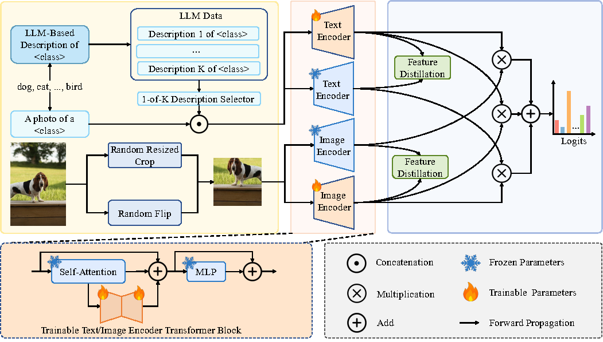

# LightRA: Lightweight Residual Attention for Adaptation of Vision-Language Models

Official implementation of the paper : "[LightRA: Lightweight Residual Attention for Adaptation of Vision-Language Models](https://ieeexplore.ieee.org/document/11450461)".

## Highlights

> **<p align="justify"> Abstract:** Vision-language models (VLMs) have demonstrated strong performance across a wide range of downstream tasks. Among them, CLIP is particularly effective in zero-shot and few-shot learning, offering a promising solution for scenarios with limited labeled data. Yet, fine-tuning CLIP remains a significant challenge for downstream few-shot generalization tasks, as excessive learnable parameters often lead to overfitting on seen classes, thereby limiting generalization to unseen classes. To tackle this issue, various lightweight few-shot tuning methods have been introduced to adapt CLIP to downstream tasks. However, these methods still face several limitations. First, the initial outputs of newly introduced modules may interfere with the pre-trained representation space, ultimately affecting the model’s final fine-tuning performance. Second, many existing approaches primarily rely on task-specific supervision, with limited mechanisms to explicitly leverage the guidance from the pre-trained model itself. In this work, we propose a \textbf{Light}weight \textbf{R}esidual \textbf{A}ttention (LightRA) framework for few-shot adaptation. LightRA incorporates a lightweight residual module into the multi-head attention of the Transformer-based CLIP model. The residual module is initialized in a non-intrusive manner and progressively optimized to ensure minimal deviation from the original representations. By employing a self-distillation strategy, the pre-trained model itself serves as the teacher to guide the learnable parameters in LightRA, enabling them to acquire both generalizable and task-relevant knowledge, thereby improving adaptability to downstream tasks while effectively mitigating overfitting. We conduct extensive experiments on three widely used and challenging few-shot generalization tasks, and the results demonstrate that LightRA consistently outperforms existing state-of-the-art methods.
</p>

## Installation

```python
# Clone LightRA code
git clone https://github.com/longinhit/LightRA.git

cd LightRA

# Create a conda environment from the YAML file
conda env create -f LightRA_env.yml
```

## Datasets

Follow [DATASETS.md](docs/DATASETS.md) to install the datasets.

## Training and Evaluation

```shell
# Base-to-Novel Generalization
bash run_base2novel.sh

# Few-Shot Evaluation
bash run_few-shot.sh

# Cross-Dataset Evaluation and Domain Generalization
bash run_xd.sh
```

## Experimental Results
Results reported below show accuracy for base and novel classes for across 11 recognition datasets averaged over 3 seeds.
| Name                                                                                                                                 | Base Acc. | Novel Acc. |    HM     |
| ------------------------------------------------------------------------------------------------------------------------------------ | :-------: | :--------: | :-------: |
| [CLIP](https://arxiv.org/abs/2103.00020)                                                                                             |   69.34   |   74.22    |   71.70   |
| [CoOp](https://arxiv.org/abs/2109.01134)                                                                                             |   82.69   |   63.22    |   71.66   |
| [CoCoOp](https://arxiv.org/abs/2203.05557)                                                                                           |   80.47   |   71.69    |   75.83   |
| [MaPLe](https://arxiv.org/abs/2210.03117)                                                                                            |   82.28   |   75.14    |   78.55   |
| [PromptSRC](https://arxiv.org/abs/2307.06948)                                                                                        |   84.26   |   76.10    |   79.97   |
| [CoPrompt](https://arxiv.org/abs/2306.01195)                                                                                         |   84.00   |   77.23    |   80.48   |
| [HPT](https://arxiv.org/abs/2312.06323)                                                                                              |   84.32   |   76.86    |   80.42   |
| [ProVP-Ref](https://arxiv.org/pdf/2304.08386)                                                                                        | **85.20** |   73.22    |   78.76   |
| [LightRA](https://ieeexplore.ieee.org/document/11450461)                                                                             |   84.94   |  **78.51** | **81.60** |

We provide all trained model checkpoints and logs to reproduce our results at this Google Drive [link](https://drive.google.com/drive/folders/1rIcXxi7t51208qq5jfonk8x7j4A5Ug5v?usp=sharing)


## Citation
If you find our work or this repo helpful for your research, please kindly cite the following paper:

```bash
@ARTICLE{LightRA,
  title={LightRA: Lightweight Residual Attention for Adaptation of Vision-Language Models}, 
  journal={IEEE Transactions on Multimedia}, 
  author={Jiao, Jiulong and Zhou, Yizhi and Wu, Li and Song, Zhipeng and Kong, Xiangyu and Cao, Yuan and Qi, Heng},
  year={2026},
  pages={1-12},
  doi={10.1109/TMM.2026.3676654}}
```

## Acknowledgements

Our code is based on [CoOp](https://github.com/KaiyangZhou/CoOp), [PromptSRC](https://github.com/muzairkhattak/PromptSRC/tree/main) and [CoPrompt](https://github.com/ShuvenduRoy/CoPrompt/tree/main) repositories. We thank the authors for releasing their codes.